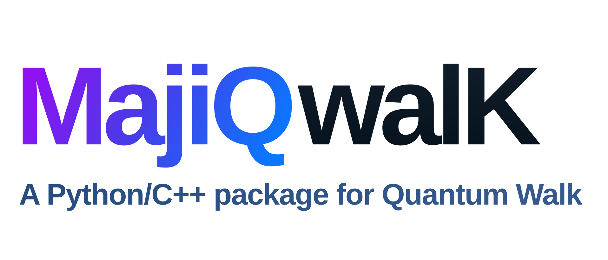

# MajiQwalK

<p align="center"></p>

**A modular discrete-time quantum-walk package with a C++20 numerical core and a Python API and command line.**

Author: **Majid Moradi Kelardeh**, Pavol Jozef Šafárik University in Košice.
[Academic page](https://mkmajiid.github.io) · [ORCID](https://orcid.org/0000-0001-9479-2042).

Version **0.1.0.dev5** adds quantum/classical transport comparison, finite-time transport-scaling diagnostics, persistent classical random walks, and repository branding on top of the validated quantum/classical core. It is not a stable production release or a package already published on PyPI. The development source archive requires Python and a C++20 compiler. The self-contained Windows/Linux release workflow is provided separately and needs target-platform release validation.

## Implemented

- Ordinary coined quantum evolution, **coin then shift**, on line, square and simple-cubic lattices.
- Classical nearest-neighbour random walks on the same Cartesian geometries, including memoryless isotropic/biased walks and persistent directional-memory walks.
- General custom unitary coins; Hadamard and parameterized U(2) for two-port walks; tensor Hadamard on square walks; axis-wise Hadamard, Grover, DFT/Fourier and identity coins for supported multidimensional port spaces.
- Localized, distributed product and arbitrary full pure initial states.
- Explicit open-window, periodic and reflecting boundaries.
- Complex double precision; CPU propagation and optional OpenMP coin processing.
- Strict, versioned YAML configuration with numerical physics checks and JSON schema.
- Streaming HDF5 output: probabilities, raw moments, variances, norm, reduced coin state, coin-position entropy, optional state snapshots and finite-time averaged probabilities.
- Python API, `majiqwalk` CLI, CSV probability export and a Physical Review figure profile.
- Independent small-system matrix references, exact short-time checks and a ballistic asymptotic benchmark.

Density-matrix execution, channels, CUDA, split-step, accelerating, memory, Möbius walks, arbitrary graphs, sphere meshes, FI/QFIM and Uhlmann curvature are **planned extensions**. They are not advertised as executable features. See [roadmap](docs/developer/roadmap.md).

## Install from this source

Linux: install Python 3.10 or later and a C++20 compiler (for example `g++` from your distribution). Use an isolated environment:

```bash
python3 -m venv .venv
source .venv/bin/activate
python -m pip install --upgrade pip
python -m pip install ".[plot]"
```

Windows source builds require Visual Studio C++ Build Tools with C++20 support. Activate the virtual environment with `.venv\Scripts\activate`, then run the same pip install. Pip obtains CMake, pybind11 and other build dependencies automatically. OpenMP is enabled when the compiler provides it; otherwise the serial backend works.

## First run

From the repository directory:

```bash
majiqwalk validate examples/line/hadamard.yaml
majiqwalk run examples/line/hadamard.yaml
majiqwalk inspect examples/line/line_hadamard.h5
majiqwalk plot examples/line/line_hadamard.h5 --directory figures
majiqwalk export examples/line/line_hadamard.h5 --output probability.csv
```

`majiqwalk examples/line/hadamard.yaml` is also accepted. `python -m majiqwalk` provides the same commands. CLI output paths from YAML are relative to the configuration file; `--output` is relative to the current working directory. Existing HDF5 results are preserved unless `--overwrite` or `output.overwrite: true` is set.

Shipped examples include line Hadamard/custom quantum walks, Grover/DFT/identity/Hadamard-family multidimensional quantum walks, and symmetric, biased, square and cubic classical random walks. Output files use `<geometry>_<coin>.h5` (for example `square_dft.h5` or `cubic_identity.h5`). These names are
explicitly configured in `output.file`; the engine does not choose a name from
the coin or geometry. The HDF5 extension is `.h5`.

Python:

```python
from majiqwalk import Config, Simulation

config = Config.from_yaml("examples/line/hadamard.yaml")
result = Simulation(config).run("my_run.h5")
final_probability = result.read("observables/probability", -1)
steps = result.steps
```

The Python API resolves its output path relative to the current working directory. Reading `result.probability` loads the full sampled distribution history; use `result.read(dataset, selection)` for large results. After changing YAML parameters such as `simulation.steps`, rerun the simulation with a new output filename or `--overwrite` before plotting; the plotter rejects stale/inconsistent HDF5 data.

## Manuals and conventions

- [User guide](docs/user-guide/manual.md): configuration, runs, outputs and plotting.
- [Theory](docs/theory/coined_walk.md): Hilbert space, coins, shift, entanglement and averaging.
- [Architecture](docs/developer/architecture.md): C++ contracts, Python responsibilities and extension points.
- [Roadmap](docs/developer/roadmap.md): implemented features and future milestones.
- [Scientific references](docs/references/references.md).
- [Validation](docs/developer/validation.md).

The amplitude index is `site * coin_dimension + port`. Ports are `[-x,+x]`, `[-x,+x,-y,+y]`, or `[-x,+x,-y,+y,-z,+z]`. Spatial coordinates use C ordering. All angles are in radians. Entropy is in **bits**.

## Development checks

```bash
python -m pip install ".[dev]"
python -m pytest -q
cmake -S . -B build/cpp -DMAJIQWALK_BUILD_PYTHON=OFF -DMAJIQWALK_BUILD_TESTS=ON
cmake --build build/cpp --config Release
ctest --test-dir build/cpp -C Release --output-on-failure
python -m build
```

Configuration schema regeneration:

```bash
majiqwalk schema > schemas/config-v1.json
```

## License and citation

MajiQwalK is licensed under **Apache-2.0**; see [LICENSE](LICENSE) and [NOTICE](NOTICE). Citation metadata is in [CITATION.cff](CITATION.cff). There is no MajiQwalK paper or Zenodo DOI yet; do not cite an invented DOI. For a scientific publication, record the exact software version and cite the literature defining the walk you use. A release DOI and associated methods paper can be added later.

## GitHub and academic page

The public source repository is [MKMajiid/MajiQwalK](https://github.com/MKMajiid/MajiQwalK). Version `0.1.0.dev5` is a development milestone; create the first tagged pre-release only after the Linux/Windows CI matrix and portable-build validation pass for the exact release commit. See the [publication steps](docs/developer/publishing.md).


### Classical baseline example

```yaml
model:
  type: classical_random_walk
geometry:
  type: line
  shape: [201]
classical:
  step_probabilities: [0.5, 0.5]
simulation:
  steps: 100
```

For a classical random walk, `coin` is omitted and the state is a normalized position probability distribution. The same probability, moment, variance and plotting pipeline is used, which makes quantum/classical transport comparisons straightforward.


## Quantum/classical transport comparison

Run compatible simulations with the same geometry and sampled time grid, then compare them directly:

```bash
majiqwalk compare quantum.h5 classical.h5 --directory figures
majiqwalk transport quantum.h5
majiqwalk transport classical.h5
```

The comparison command writes final probability/marginal, total-variance and RMS-displacement figures. The transport command fits the late finite-time law `sigma^2(t) = A t^alpha` and reports `alpha`, the prefactor and fit quality. The reported exponent is explicitly a **finite-time diagnostic**, not an asymptotic proof.

Persistent classical walks are configured with `classical.type: persistent`. A scalar `persistence` produces a directional Markov chain that continues in the same direction with that probability and redistributes the remaining probability uniformly among other directions. A full column-stochastic transition matrix can be supplied instead.


A ready-made classical baseline matching the shipped 200-step Hadamard line example is `examples/line/classical_hadamard_baseline.yaml`; this pair can be used directly with `majiqwalk compare`.
